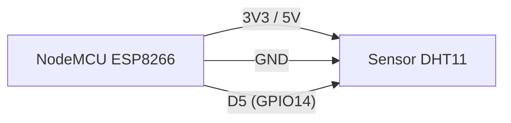
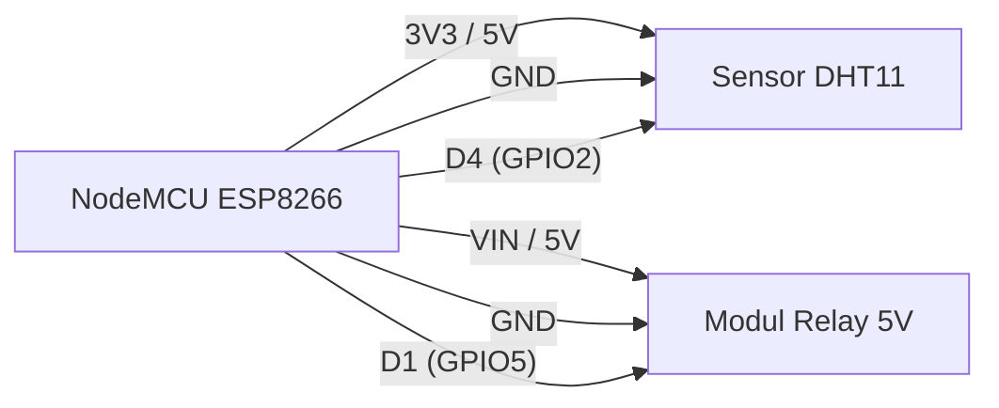

# Praktikum IoT - Modul 1: Sensor dan Aktuator

Dokumentasi praktikum Modul 1 IoT: pembacaan sensor DHT11 (suhu dan kelembaban) serta pengendalian aktuator relay berbasis ESP8266 (NodeMCU).

---

## 1. Percobaan 1: Pembacaan Sensor DHT11

### A. Penjelasan Singkat Percobaan
Membaca nilai suhu dan kelembaban lingkungan menggunakan sensor DHT11, lalu menampilkan hasil pembacaan ke Serial Monitor setiap 1 detik.

### B. Library & Dependencies
*   **DHT11 library by Dhruba Saha** (`DHT11.h`)

### C. Penjelasan Kode & Fungsi (`percobaan1.cpp`)

```cpp
#include <DHT11.h>

DHT11 dht11(D5); // Inisialisasi pin data DHT11 pada pin D5 (GPIO14)

void setup() {
    Serial.begin(9600); // Set baud rate komunikasi serial ke 9600 bps
}

void loop() {
    int temperature = 0;
    int humidity = 0;
    int result = dht11.readTemperatureHumidity(temperature, humidity); // Baca sensor

    if (result == 0) { // Cek status baca
        Serial.print("Temperature: ");
        Serial.print(temperature);
        Serial.print(" °C\tHumidity: ");
        Serial.print(humidity);
        Serial.println(" %");
    } else {
        Serial.println(DHT11::getErrorString(result)); // Cetak pesan gagal
    }

    delay(1000); // Jeda sampling 1 detik
}
```

*   `DHT11 dht11(D5)`: Instansiasi objek sensor pada pin D5 (GPIO14 NodeMCU).
*   `Serial.begin(9600)`: Inisialisasi UART kecepatan 9600 baud untuk debugging/log serial.
*   `dht11.readTemperatureHumidity(temperature, humidity)`: Mengambil data suhu dan kelembaban sekaligus. Mengembalikan integer status (`0` tanda sukses).
*   `DHT11::getErrorString(result)`: Menerjemahkan kode status error ke pesan teks terbaca.
*   `delay(1000)`: Memberi interval pembacaan 1000 ms.

### D. Penjelasan Percabangan / Conditional
*   `if (result == 0)`: Mengevaluasi status pembacaan sensor. Jika bernilai `0` (berhasil), data suhu dan kelembaban dicetak ke serial.
*   `else`: Berjalan jika `result != 0` (gagal membaca), mengeluarkan pesan kesalahan yang sesuai.

---

## 2. Percobaan 2: Kontrol Aktuator Relay Berdasarkan Suhu

### A. Penjelasan Singkat Percobaan
Membaca parameter suhu dan kelembaban dengan sensor DHT11, lalu mengontrol kondisi ON/OFF modul relay secara otomatis berdasarkan nilai ambang batas (*threshold*) suhu 29.0 °C.

### B. Library & Dependencies
*   **DHT sensor library by Adafruit** (`DHT.h`)
*   **Adafruit Unified Sensor** (dependency pendukung library Adafruit DHT)

### C. Penjelasan Kode & Fungsi (`percobaan2.cpp`)

```cpp
#include <DHT.h>

#define DHTPIN D4         // Pin data sensor DHT11 di D4 (GPIO2)
#define DHTTYPE DHT11     // Tipe sensor: DHT11
#define RELAYPIN D1       // Pin kontrol relay di D1 (GPIO5)

DHT dht(DHTPIN, DHTTYPE);

const float suhuThreshold = 29.0; // Batas suhu pemicu relay (°C)

void setup() {
  Serial.begin(9600);
  dht.begin();
  
  pinMode(RELAYPIN, OUTPUT);
  digitalWrite(RELAYPIN, HIGH); // Kondisi awal: relay mati (Active LOW)
}

void loop() {
  delay(1000);

  float humidity = dht.readHumidity();
  float temperature = dht.readTemperature();

  if (isnan(humidity) || isnan(temperature)) { // Validasi bacaan sensor
    Serial.println("Gagal membaca dari sensor DHT11!");
    return;
  }

  Serial.print("Temperature: ");
  Serial.print(temperature, 1);
  Serial.print(" °C\tHumidity: ");
  Serial.print(humidity, 1);
  Serial.print(" % -> ");

  if (temperature > suhuThreshold) { // Evaluasi batas suhu
    digitalWrite(RELAYPIN, LOW);   // Relay ON
    Serial.println("Aktuator: ON");
  } else {
    digitalWrite(RELAYPIN, HIGH);  // Relay OFF
    Serial.println("Aktuator: OFF");
  }
}
```

*   `#define DHTPIN D4`: Mapping pin sensor ke pin digital D4 (GPIO2).
*   `#define RELAYPIN D1`: Mapping pin kontrol relay ke D1 (GPIO5).
*   `DHT dht(DHTPIN, DHTTYPE)`: Membuat objek sensor dengan konfigurasi pin dan tipe sensor.
*   `dht.begin()`: Inisialisasi jalur komunikasi sensor DHT.
*   `pinMode(RELAYPIN, OUTPUT)`: Mengatur pin relay sebagai output kontrol tegangan.
*   `dht.readHumidity()` & `dht.readTemperature()`: Mengembalikan nilai kelembaban (RH %) dan suhu (°C) bertipe float.
*   `isnan(...)`: Memeriksa apakah nilai hasil bacaan adalah invalid / bukan angka (*Not a Number*).
*   `digitalWrite(RELAYPIN, LOW/HIGH)`: Mengatur level logika tegangan pin relay.

### D. Penjelasan Percabangan / Conditional
1.  `if (isnan(humidity) || isnan(temperature))`:
    *   Mengecek kegagalan hardware/komunikasi sensor.
    *   Jika salah satu bernilai `NaN`, tampilkan pesan error dan jalankan `return;` untuk menghentikan iterasi `loop()` saat itu.
2.  `if (temperature > suhuThreshold)`:
    *   Jika suhu > 29.0 °C: Menjalankan `digitalWrite(RELAYPIN, LOW)` (relay aktif/ON karena modul bertipe Active LOW) dan cetak status ke serial.
    *   `else`: Jika suhu <= 29.0 °C: Menjalankan `digitalWrite(RELAYPIN, HIGH)` (relay nonaktif/OFF) dan cetak status ke serial.

---

## 3. Jawaban Pertanyaan Praktikum (6.4)

### 1. Mengapa diperlukan nilai ambang batas (threshold) dalam sistem kendali aktuator berbasis sensor?
Agar mikrokontroler punya acuan pasti (titik potong/trigger) untuk mengubah status aktuator (ON/OFF).

### 2. Jelaskan apa yang akan terjadi apabila nilai `suhuThreshold` diturunkan menjadi sangat rendah, misalnya 20.0!
Karena suhu ruangan normal (25-30°C) selalu di atas 20.0°C, aktuator akan ON terus-menerus. Sistem kendali jadi tidak berguna.

### 3. Apa perbedaan antara kendali aktuator secara terus-menerus (kondisi tunggal) dengan kendali menggunakan histerisis (dua ambang batas)?
* **Kondisi Tunggal:** 1 titik acuan. Aktuator *chattering* (nyala-mati cepat) saat suhu berfluktuasi pas di titik batas, bikin cepat rusak.
* **Histerisis:** 2 titik acuan (batas atas & bawah). Ada *deadband* / jeda aman, aktuator lebih stabil jika suhu naik-turun tipis.

### 4. Modifikasi program agar menggunakan dua ambang batas (histerisis)
ON jika > 30°C, OFF jika < 28°C.

#### Kode Modifikasi (`histerisis`):
```cpp
#include <DHT.h>

#define DHTPIN D4         // Pin data DHT11 terhubung ke D4 (GPIO2)
#define DHTTYPE DHT11     // Definisikan tipe sensor DHT11
#define RELAYPIN D1       // Pin kendali modul relay di D1 (GPIO5)

DHT dht(DHTPIN, DHTTYPE); // Instansiasi objek dht dengan pin & tipe

const float batasAtas = 30.0; // Ambang batas atas untuk menyalakan relay
const float batasBawah = 28.0; // Ambang batas bawah untuk mematikan relay

void setup() {
  Serial.begin(9600);           // Inisialisasi komunikasi serial 9600 bps
  dht.begin();                  // Inisialisasi sensor DHT11
  
  pinMode(RELAYPIN, OUTPUT);    // Set pin relay sebagai output
  digitalWrite(RELAYPIN, HIGH); // Set default relay MATI di awal (Active LOW)
}

void loop() {
  delay(1000);                  // Jeda 1 detik antar pembacaan

  float humidity = dht.readHumidity();       // Baca nilai kelembaban
  float temperature = dht.readTemperature(); // Baca nilai suhu

  if (isnan(humidity) || isnan(temperature)) { // Validasi jika sensor gagal terbaca
    Serial.println("Gagal membaca dari sensor DHT11!"); // Tampilkan pesan gagal
    return;                     // Hentikan iterasi loop saat ini
  }

  Serial.print("Temperature: ");
  Serial.print(temperature, 1); // Tampilkan suhu dengan 1 digit desimal
  Serial.print(" °C\tHumidity: ");
  Serial.print(humidity, 1);    // Tampilkan kelembaban dengan 1 digit desimal
  Serial.print(" % -> ");

  // Logika Kendali Histerisis (Active LOW Relay)
  if (temperature > batasAtas) {
    digitalWrite(RELAYPIN, LOW);   // Relay ON (suhu panas melewati 30.0 °C)
    Serial.println("Aktuator: ON (Suhu Panas)");
  } else if (temperature < batasBawah) {
    digitalWrite(RELAYPIN, HIGH);  // Relay OFF (suhu turun di bawah 28.0 °C)
    Serial.println("Aktuator: OFF (Suhu Dingin)");
  } else {
    // Suhu di rentang 28.0 - 30.0 °C: pertahankan status relay sebelumnya
    Serial.println("Aktuator: MEMPERTAHANKAN STATUS");
  }
}
```

#### Penjelasan Setiap Baris Kode Modifikasi:
*   `#include <DHT.h>`: Memuat library DHT dari Adafruit untuk komunikasi dengan sensor.
*   `#define DHTPIN D4`: Memberi alias pin data sensor DHT11 ke pin D4 (GPIO2 ESP8266).
*   `#define DHTTYPE DHT11`: Menetapkan model hardware sensor yang digunakan (DHT11).
*   `#define RELAYPIN D1`: Memberi alias pin pemicu modul relay ke pin D1 (GPIO5 ESP8266).
*   `DHT dht(DHTPIN, DHTTYPE)`: Mengonfigurasi objek sensor `dht` sesuai pin dan model yang telah didefinisikan.
*   `const float batasAtas = 30.0`: Mendeklarasikan ambang atas konstan sebesar 30.0 °C untuk aktivasi aktuator.
*   `const float batasBawah = 28.0`: Mendeklarasikan ambang bawah konstan sebesar 28.0 °C untuk deaktivasi aktuator.
*   `void setup() { ... }`: Fungsi inisialisasi hardware mikrokontroler yang hanya dieksekusi satu kali saat *boot*.
*   `Serial.begin(9600)`: Mengatur kecepatan transfer data serial monitor sebesar 9600 baud.
*   `dht.begin()`: Mengaktifkan jalur komunikasi bus sensor DHT11.
*   `pinMode(RELAYPIN, OUTPUT)`: Menentukan bahwa pin D1 bertindak sebagai output penyuplai sinyal kontrol tegangan.
*   `digitalWrite(RELAYPIN, HIGH)`: Memberikan logika HIGH (3.3V) ke pin relay agar modul tetap kondisi mati saat baru dinyalakan (logika *Active LOW*).
*   `void loop() { ... }`: Fungsi loop utama yang terus berulang tanpa henti selama mikrokontroler aktif.
*   `delay(1000)`: Menghentikan proses loop selama 1000 ms agar sampling sensor tidak terlalu cepat.
*   `float humidity = dht.readHumidity()`: Membaca kelembaban udara relatif dari sensor dalam tipe desimal (`float`).
*   `float temperature = dht.readTemperature()`: Membaca suhu lingkungan dalam satuan Celsius bertipe desimal (`float`).
*   `if (isnan(humidity) || isnan(temperature))`: Memeriksa apakah salah satu data sensor tidak valid (*Not a Number*).
*   `Serial.println("Gagal membaca dari sensor DHT11!")`: Mencetak peringatan jika sensor mengalami gangguan.
*   `return;`: Langsung melompati sisa instruksi `loop()` dan kembali ke iterasi awal jika pembacaan gagal.
*   `Serial.print(...)`: Mencetak teks dan data angka suhu serta kelembaban ke serial monitor.
*   `if (temperature > batasAtas)`: Pengecekan kondisi: jika suhu terbaca lebih dari 30.0 °C.
*   `digitalWrite(RELAYPIN, LOW)`: Mengalirkan sinyal LOW (0V) untuk mengaktifkan kontak relay (Active LOW = ON).
*   `else if (temperature < batasBawah)`: Pengecekan kondisi kedua: jika suhu turun di bawah 28.0 °C.
*   `digitalWrite(RELAYPIN, HIGH)`: Mengalirkan sinyal HIGH (3.3V) untuk memutus kontak relay (Active LOW = OFF).
*   `else`: Berjalan jika suhu berada di area *deadband* (antara 28.0 °C hingga 30.0 °C). Tidak ada perubahan pin relay (`digitalWrite` tidak dipanggil), status relay sebelumnya dipertahankan.

---

## 4. Skematik & Diagram Rangkaian

### Rangkaian Percobaan 1


### Rangkaian Percobaan 2

### Hasil Percobaan
#### Output Percobaan 1

#### Output Percobaan 2

